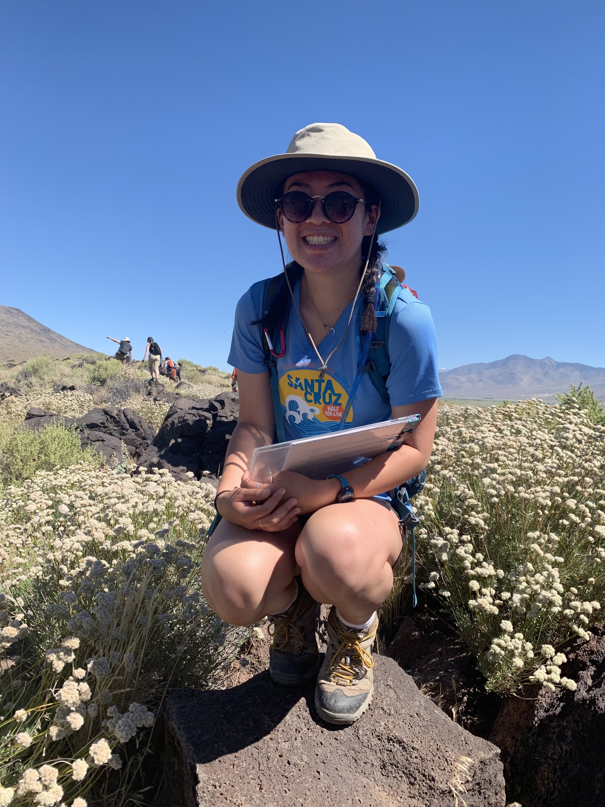

As a Native Hawaiian, hands-on conservation through Kamehameha Schools and my culture taught me to respect the land and ocean. This led to a B.S. in Earth Science with a concentration in Environmental Geology from UC Santa Cruz. During my undergraduate career, I was fortunate to explore central and northern California through geologic mapping expeditions. I gained skills in ArcGIS, Stereonet, stratigraphy, petrology, and structural analyses. 


```{r, echo = FALSE, out.width = '60%', results = 'markup', fig.align = 'center'} 

```


I pursued further education at the Bren School of Environmental Science & Management to incorporate my geology training toward management skills for coastal and ocean issues as it relates to environmental justice and equity. My interests include coastal science, coastal policy, and its intersection. I want to integrate policy into developing technical solutions for coastal resilience and resource management as impacted by climate change. 


```{r, echo = FALSE, fig.align = 'center', results = 'markup'} 
knitr::include_graphics("images/pointlobos.jpg")
```


Without collaboration and inclusion, we cannot fully implemeent new scientific ideas. Outside of school, educating and communicating science to others is a passion of mine. I enjoy volunteering at the Ocean Institutie, Dana Point and working with the Girls in Ocean Science Committee to connecting influential female scientists with the next generation of ocean ambassadors, 


In my free times, I enjoy hiking and enjoying the ocean. When I am not in school, people often find me at the beach or my favorite place, Big Sur, California.  


```{r, echo = FALSE, fig.align = 'center', results = 'markup'} 
knitr::include_graphics("images/bigsur.jpeg")
```